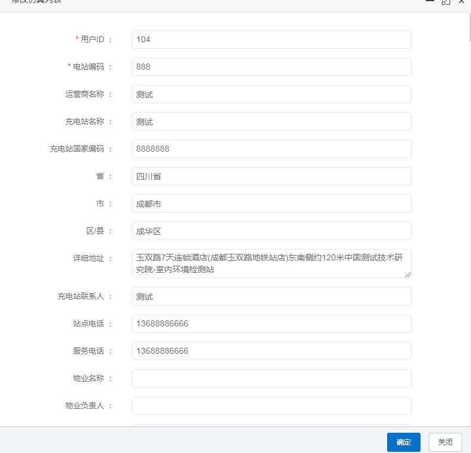
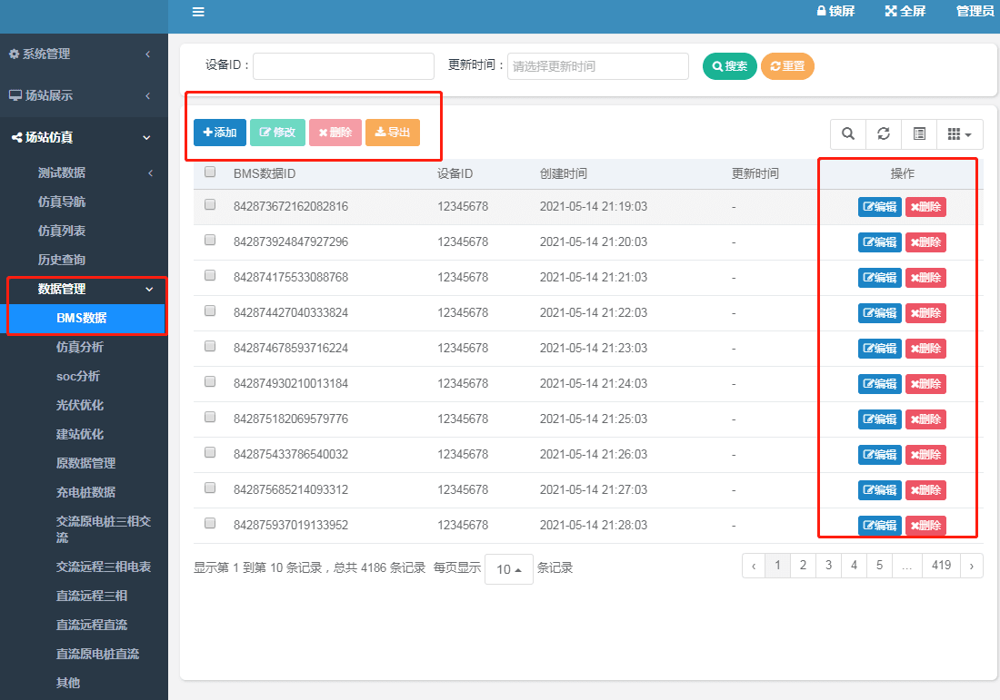

## 登录
* **管理员账号:admin** 
* **密码:admin888**
* 使用管理员账号可以登录后台管理系统进行用户管理和数据管理，该管理系统使用的是若依框架，具体功能可以查看官方文档(http://doc.ruoyi.vip/ruoyi/)
## 系统管理

* **用户管理:** 点击新增按钮可以添加用户，点击修改/编辑可以修改用户信息，点击删除可删除用户，点击导入可导入用户数据，点击导出可导出用户数据。

* **角色管理:** 点击新增按钮可以添加角色，点击修改/编辑可以修改角色信息，点击删除可删除角色，点击导出可导出角色数据。

* **菜单管理:** 点击新增按钮可以添加菜单，目录是一级菜单，菜单是二级菜单。

* 点击修改/编辑可以修改菜单信息，点击删除可删除菜单。

* **字典管理:** 字典的功能就是为不同的对象设置状态。

* **日志管理:** 查看后台系统操作和登录记录。
## 场站展示
* **电站地图：**进入地图可以查看电站位置，点击电站名称->查看详情 可以实时查看电站具体信息

## 场站仿真
* **仿真导航：** 点击步骤一到步骤六的->编辑参数 根据提示输入参数 点击->完成 即可生成并进入仿真模型 页面

  
* 点击->能耗分析/收益分析 可以查看分析结果

  
* 点击->参数优化 选择->充放电优化/ 光伏优化/建站优化 点击->启动分析 即可生成仿真优化分析结果

* **仿真列表：**显示的是编辑完参数但是有未完成仿真优化的仿真模型

* 点击->编辑 可以修改参数   

* 点击->仿真查询 可以进入仿真模型进行仿真优化分析或者重新仿真

* **历史查询：**显示的是完成所有仿真优化分析的仿真模型，点击->仿真查询 可以查看具体信息
* **数据管理：**仿真数据、BMS数据、电表数据 

## 场站孪生系统
* **远程计量：**
* **安全评估：**

## 系统监控
* **在线用户：**查看用户在线情况
* **服务监控：**查看服务器配置
## 系统工具
* **代码生成：**
